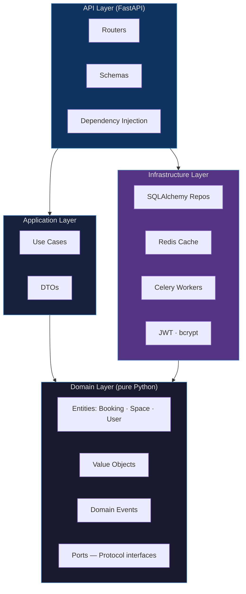

# BookingAPI

> Production-grade REST API for space and room booking management — coworking, meeting rooms, consultation slots.

[](https://github.com/LucasBenitez7/booking-api/actions/workflows/ci.yml)
[](https://github.com/LucasBenitez7/booking-api/actions/workflows/security.yml)
[](https://www.python.org/downloads/)
[](https://fastapi.tiangolo.com)
[](https://github.com/astral-sh/ruff)
[](https://mypy.readthedocs.io/)
[](LICENSE)

---

## 🚀 Live API

**📖 [booking.lsbstack.com/docs](https://booking.lsbstack.com/docs)** — Swagger UI (interactive, try it live)

### How to explore the API

**Option 1 — Admin user (full access)**

1. Open `POST /auth/login` → click **Try it out** → use these credentials:

```json
{
  "email": "adminlsb@bookingapi.com",
  "password": "Admin1234!"
}
```

2. Copy the `access_token` from the response
3. Click **Authorize** (top right) → paste the token → **Authorize**
4. All endpoints including admin (create spaces, list all bookings, manage users) are now unlocked

**Option 2 — Regular user**

1. Open `POST /auth/register` → click **Try it out** → register with any email and password
2. Copy the `access_token` from the response
3. Click **Authorize** → paste the token → **Authorize**
4. Bookings endpoints are now available

---

## What this is

BookingAPI is a portfolio project that demonstrates building a **production-grade Python backend** from scratch. It implements:

- Hexagonal Architecture (Ports & Adapters) — strict dependency inversion
- Async FastAPI with PostgreSQL, Redis, and Celery
- JWT authentication with refresh token rotation in HttpOnly cookies
- Availability caching with Redis, invalidated on mutations
- Background workers (booking confirmations, reminders, expired booking cleanup)
- Kubernetes deployment with HPA, zero-downtime rolling updates, and NetworkPolicy
- Full CI/CD pipeline with GitHub Actions, ECR, and release-please

---

## Architecture

BookingAPI follows **Hexagonal Architecture**. The dependency rule is absolute: inner layers never import from outer layers.



**Key design decisions:**

- Domain entities are **pure Python** — no SQLAlchemy, no Pydantic, no FastAPI imports
- SQLAlchemy models and domain entities are **always separate classes** connected by mappers
- Ports are defined as `Protocol` interfaces in `domain/ports/` — infrastructure implements them, never the reverse
- Application DTOs use **plain dataclasses**, not Pydantic (Pydantic is HTTP-only)

---

## Stack

| Layer | Technology |
|---|---|
| Language | Python 3.12 |
| Package manager | uv |
| API | FastAPI + Pydantic v2 |
| Database | PostgreSQL 16 + SQLAlchemy 2.0 async |
| Migrations | Alembic |
| Cache / broker | Redis 7 |
| Background jobs | Celery + celery-beat |
| Auth | PyJWT + bcrypt (async via thread executor) |
| Rate limiting | slowapi |
| Logging | structlog (JSON, with request ID) |
| Linting | Ruff |
| Type checking | mypy strict |
| Testing | pytest + httpx + factory-boy + pytest-asyncio |
| Containers | Docker + docker-compose |
| Orchestration | Kubernetes / k3s |
| CI/CD | GitHub Actions → Amazon ECR → kubectl rolling update |

---

## API Endpoints

### Auth

| Method | Endpoint | Description | Auth |
|---|---|---|---|
| `POST` | `/auth/register` | Register a new user | — |
| `POST` | `/auth/login` | Login — returns access token + sets refresh cookie | — |
| `POST` | `/auth/refresh` | Rotate access token using HttpOnly refresh cookie | Cookie |
| `POST` | `/auth/logout` | Clear refresh cookie | Cookie |
| `POST` | `/auth/password-reset/request` | Request password reset email | — |
| `POST` | `/auth/password-reset/confirm` | Confirm reset with token | — |

### Spaces

| Method | Endpoint | Description | Auth |
|---|---|---|---|
| `GET` | `/spaces` | List active spaces | — |
| `GET` | `/spaces/{id}` | Get space details | — |
| `GET` | `/spaces/{id}/availability` | Check availability for a time slot (cached) | — |

### Bookings

| Method | Endpoint | Description | Auth |
|---|---|---|---|
| `POST` | `/bookings` | Create a booking | Bearer |
| `GET` | `/bookings` | List my bookings (filterable by status) | Bearer |
| `GET` | `/bookings/{id}` | Get booking details | Bearer |
| `PATCH` | `/bookings/{id}` | Update booking time slot | Bearer |
| `DELETE` | `/bookings/{id}` | Cancel booking | Bearer |

### Admin

| Method | Endpoint | Description | Auth |
|---|---|---|---|
| `POST` | `/admin/spaces` | Create a space | Admin |
| `PATCH` | `/admin/spaces/{id}` | Update space attributes | Admin |
| `DELETE` | `/admin/spaces/{id}` | Deactivate a space | Admin |
| `GET` | `/admin/bookings` | List all bookings (filterable) | Admin |
| `PATCH` | `/admin/users/{id}` | Update user (max bookings, admin flag) | Admin |

### Health

| Method | Endpoint | Description |
|---|---|---|
| `GET` | `/health` | Liveness probe |
| `GET` | `/health/ready` | Readiness probe (checks database connectivity) |

---

## Local Setup

### Prerequisites

- Docker + Docker Compose
- Python 3.12+
- [uv](https://github.com/astral-sh/uv)

### Run locally

```bash
git clone https://github.com/LucasBenitez7/booking-api.git
cd booking-api

# Copy and configure environment
cp .env.example .env

# Start services (PostgreSQL + Redis) and the API
docker compose up
```

The API is available at `http://localhost:8000`  
Swagger docs at `http://localhost:8000/docs`

### Development without Docker

```bash
# Install dependencies (includes dev extras)
uv sync --extra dev

# Start PostgreSQL and Redis separately, then:
uv run uvicorn booking.api.main:app --reload
```

### Database migrations

```bash
uv run alembic upgrade head
```

### Postman (explore the API)

1. Import `postman/environment.json`, then `postman/collection.json`, into Postman.
2. Select the environment **BookingAPI — Local** (`base_url` defaults to `http://localhost:8000`).
3. Run **0 — Setup / Reset** — wipes the database for a clean start.
4. Run **0 — Setup / Seed** — creates an admin user, a regular user, and 3 spaces. Saves `admin_token` automatically.
5. Run the folders in order: **Health → Auth → Spaces → Bookings → Admin**.

All tokens and IDs are saved automatically by test scripts — no manual steps required.

**Run the entire collection from the terminal (Newman):**

```bash
npx newman run postman/collection.json -e postman/environment.json
```

**Email notifications:** this project uses `LoggingNotificationService` — confirmation and reminder emails are printed to stdout (application logs) instead of being sent. Swapping in a real SMTP or SendGrid adapter requires changing only one line in `app_factory.py`; the domain and application layers are unaffected by design.

**Note:** the `/dev/seed` and `/dev/reset` endpoints are only available when `APP_ENV=development`. They do not exist in production.

To regenerate the collection after API changes:

```bash
uv run python scripts/generate_postman_collection.py
```

---

## Testing

```bash
# Run all unit tests
uv run pytest tests/unit/

# Run with coverage report
uv run pytest tests/unit/ --cov=src/booking --cov-report=html

# Run integration tests (requires PostgreSQL + Redis running)
uv run pytest tests/integration/
```

> **Coverage note:** the `--cov-fail-under=80` gate in CI measures coverage over the **domain and application layers** only. HTTP routers, SQLAlchemy repositories, Celery workers, and the Redis adapter are excluded from the metric because they require a running infrastructure environment — those layers are exercised by integration tests and staging. This is a deliberate choice, not a gap.

---

## Project Structure

```
postman/                    # Postman collection + environment (import into Postman)
scripts/                    # generate_postman_collection.py · run_newman.py
src/booking/
├── domain/                  # Pure Python — zero external dependencies
│   ├── entities/            #   Booking, Space, User
│   ├── value_objects/       #   BookingId, BookingStatus, TimeSlot, Email
│   ├── events/              #   BookingCreated, BookingCancelled, BookingExpired…
│   ├── exceptions/          #   DomainException hierarchy
│   └── ports/               #   Protocol interfaces (contracts for infrastructure)
├── application/
│   ├── use_cases/           #   CreateBooking, CancelBooking, GetAvailability…
│   └── dtos/                #   Input/output dataclasses (no Pydantic)
├── infrastructure/
│   ├── persistence/         #   SQLAlchemy models, mappers, repositories
│   ├── cache/               #   RedisAvailabilityCache, MemoryAvailabilityCache
│   ├── workers/             #   Celery app, tasks, beat schedule
│   ├── notifications/       #   LoggingNotificationService
│   └── security/            #   JWT, bcrypt, password reset store
└── api/
    ├── routers/             #   auth, bookings, spaces, admin, health
    ├── schemas/             #   Pydantic request/response models
    ├── middleware/          #   CORS, security headers, request ID logging
    ├── deps.py              #   FastAPI dependency injection
    └── app_factory.py       #   Application factory with lifespan
```

---

## Key Domain Decisions

**Bookings are confirmed immediately — no PENDING state**  
When a booking is created it goes directly to `CONFIRMED`. There is no intermediate state to manage or clean up.

**Business rules live in the `Space` entity**  
`Space` enforces: `min_duration_minutes`, `max_duration_minutes`, `min_advance_minutes`, `cancellation_deadline_hours`, `opening_time`, `closing_time`. A booking cannot be created without passing `space.validate_booking_slot()`.

**`EXPIRED` is a distinct terminal state from `CANCELLED`**  
Bookings whose end time passes without cancellation are marked `EXPIRED` by a Celery task — not cancelled. This preserves audit intent: a system expiration is semantically different from a user or admin cancellation.

**Availability is cached, not computed on every request**  
`GET /spaces/{id}/availability` stores its result in Redis with a 5-minute TTL. Any mutation (create, update, cancel booking) invalidates the cache for that space via `SCAN` pattern matching. An in-memory fallback is used when Redis is not configured.

**Refresh token in HttpOnly cookie**  
Access tokens (15 min) are returned in the response body. Refresh tokens (7 days) are stored in an HttpOnly cookie — never accessible from JavaScript, mitigating XSS token theft.

---

## License

[MIT](LICENSE)
